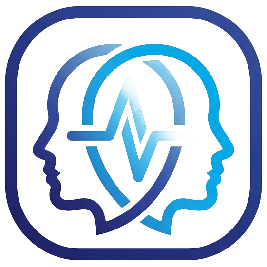

# PsychoMatch HR — İşe Alım Psikolojik Envanteri & Değerlendirme Platformu

<p align="center">
  
</p>

<p align="center">
  Big Five (OCEAN) modeli, pozisyon uyum matrisleri ve samimiyet analizi sunan interaktif aday değerlendirme platformu.
</p>

<p align="center">
  <a href="https://pm-envanter.vercel.app" target="_blank">
    
  </a>
  
  
  
  
  
</p>

---

## Canlı Demo

Uygulamayı tarayıcınızda doğrudan deneyimlemek için:  
**[pm-envanter.vercel.app](https://pm-envanter.vercel.app)**

---

## Projenin Hikayesi ve Amacı

Merhaba! Ben Beyza.

İşe alım süreçlerinde adayların yalnızca teknik yeterliliklerini değil; takım uyumu, stres yönetimi, sorumluluk bilinci ve iletişim tarzı gibi temel davranışsal dinamiklerini ölçümlemenin uzun vadeli başarı için vazgeçilmez olduğunu gözlemledim.

PsychoMatch HR; insan kaynakları uzmanlarına bilimsel temelli, anlık ve objektif bir karar destek aracı sunmak amacıyla geliştirdiğim bir değerlendirme platformudur. Küresel geçerliliği kanıtlanmış Big Five (OCEAN) modelini temel alarak adayın profilini analiz eder, hedeflenen pozisyona uygunluk skorunu hesaplar ve sosyal beğenirlik (Lie Scale) algoritmasıyla yanıtların samimiyet düzeyini denetler.

---

## Neler Yaptım ve Öne Çıkan Özellikler

- **Big Five (OCEAN) Kişilik Analizi:** Beş temel kişilik boyutunu (Duygusal Denge, Sorumluluk, Dışadönüklük, Uyumluluk, Deneyime Açıklık) ters puanlama algoritmalarıyla dengeli biçimde ölçümleyen test kurgusu.
- **Pozisyon Bazlı Uyum Skoru (Job Benchmarks):** Yazılım Geliştirici, İK Uzmanı, Proje Yöneticisi gibi roller için tanımlanan hedef profillerle adayın yetkinliklerini kıyaslayan eşleştirme motoru.
- **Samimiyet & Dürüstlük Denetimi (Lie Scale):** Adayın kendini aşırı idealize etme veya yanıltıcı yanıt verme eğilimini saptayan kontrol mekanizması.
- **Radar Grafiği & Görsel Raporlama:** Chart.js ile etkileşimli radar grafiği, güçlü yönler, gelişim alanları ve İK mülakatına özel soru önerileri.
- **İK Yönetim Paneli & Rapor Çıktısı:** Test sonuçlarının yerel olarak (LocalStorage) arşivlenmesi ve mülakat notlarıyla birlikte tek tıkla resmi rapora / PDF çıktısına dönüştürülebilmesi.

---

## Kullanılan Teknolojiler

- **Front-End:** Vanilla JavaScript (ES6+ Modüler Mimari), HTML5, Modern CSS3
- **Veri Görselleştirme:** Chart.js (Radar & Boyut Dağılımı)
- **Veri Saklama & Dağıtım:** Web Storage (LocalStorage), Vercel

---

## Nasıl Çalıştırılır?

Projeyi bilgisayarınıza klonlayıp doğrudan tarayıcınızda açabilirsiniz:

```bash
git clone https://github.com/kaya-beyza/pm-envanter.git
cd pm-envanter
```

`index.html` dosyasını tarayıcınızda çift tıklayarak veya yerel bir sunucu (Live Server) ile hemen çalıştırabilirsiniz.

---

## İletişim

**Beyza Kaya** 
- GitHub: [github.com/kaya-beyza](https://github.com/kaya-beyza)
- E-posta: [beyzzakayya@gmail.com](mailto:beyzzakayya@gmail.com)
